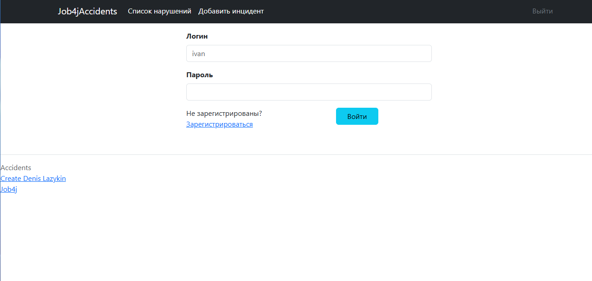
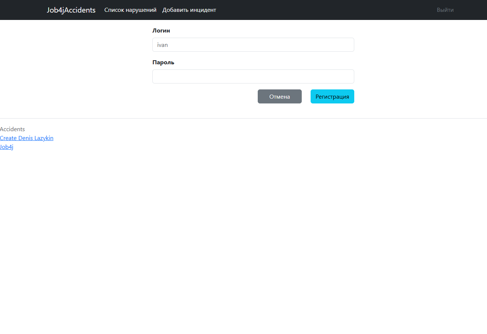
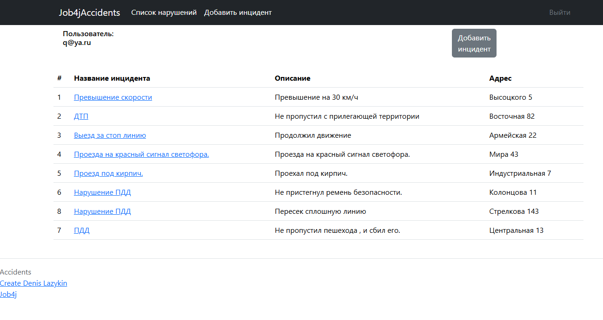
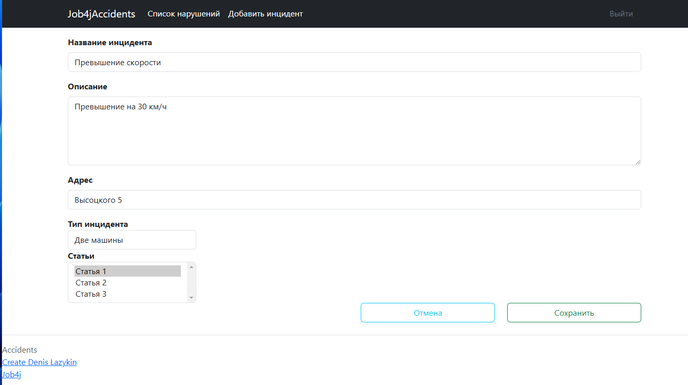
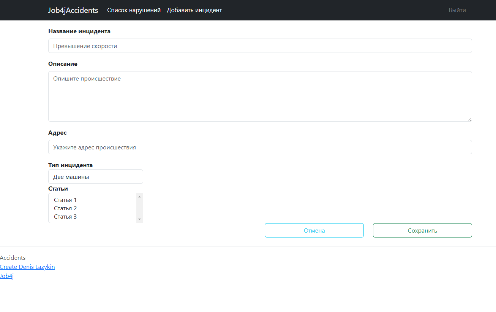

# job4j_accidents

В проекте "job4j_accidents" реализован сайт по контролю автомобильных нарушений - Авто - нарушители.

Функционал проекта позволяет:

* регистрироваться в системе;
* входить в систему;
* просматривать все инциденты;
* подробный просмотр одного инцидента;
* добавлять инциденты.

### Стек технологий.

Основные:

- Java 17
- Spring Boot 2.7.3
- Spring Security
- Spring Data 2.7.3 
- Spring JDBC 5.3.22 
- Hibernate 5.6.11 Final 
- Thymeleaf
- Bootstrap CSS 5+
- Liquibase 4.15.0
- PostgreSQL 15.1 (драйвер JDBC 42.5.1)
- checkstyle 10.0.

Тестирование:

- H2database 2.1.214
- Spring boot starter test (JUnit 5 + AssertJ, Mockito)
- Spring Security Test.

### Требования к окружению.

- Java 17
- Maven 3.8
- PostgreSQL 15.

### Запуск проекта.
Скачать проект job4j_accidents в IntelliJ Idea

Создать БД "accidents" (с помощью pgAdmin4)

Cоздайте и заполните таблицы БД  "accidents". Откройте закладку Maven -> plugins -> liquibase. Найдите задачу liquibase:update и выполните ее.

Запустите приложение в классе Main (ru/job4j/accidents/Main.java)

Откройте страницу http://localhost:8080/ в браузере

### Screenshots работы с приложением.

- [x] Страница логина, в случае ввода неверного логина будет ошибка.

  

- [x] Страница регистрации, в случае повторной регистрации - будет ошибка.

  

- [x] Список инцидентов

  

- [x] Страница редактирования инцидента

  

- [x] Страница добавления инцидента

  

#### Контакты для связи:
* Лазыкин Денис Андреевич;
* +926 888 23 28 telegram;
* dzaka89@gmail.com